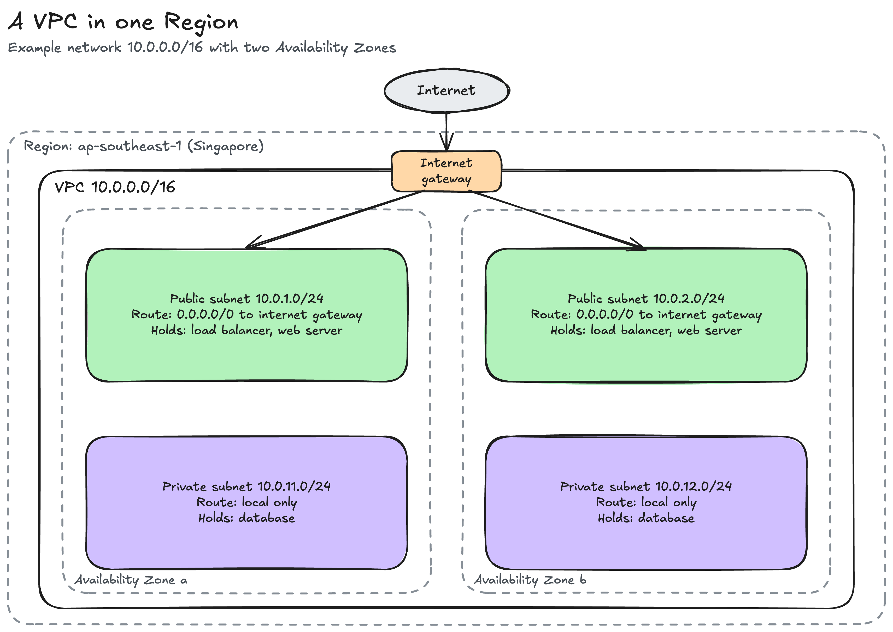
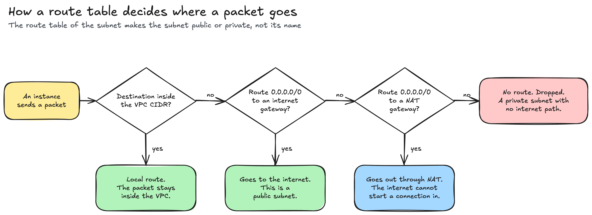
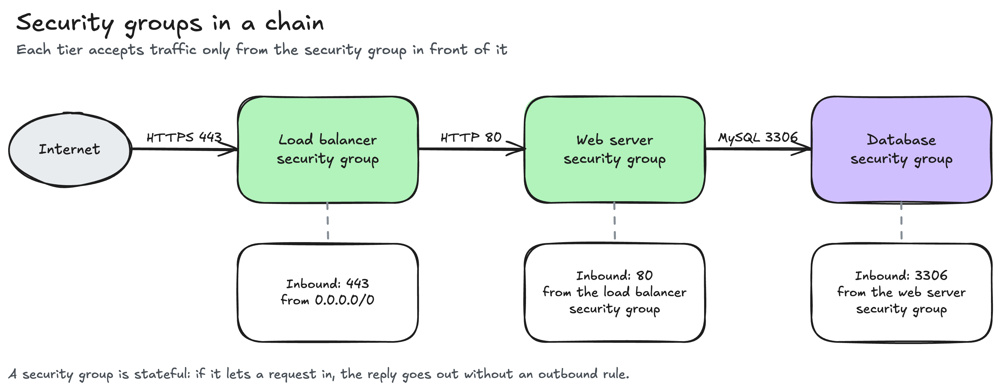
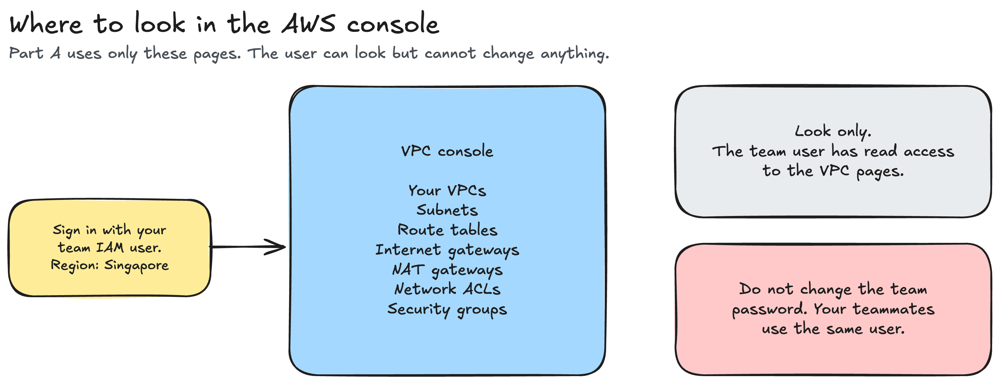
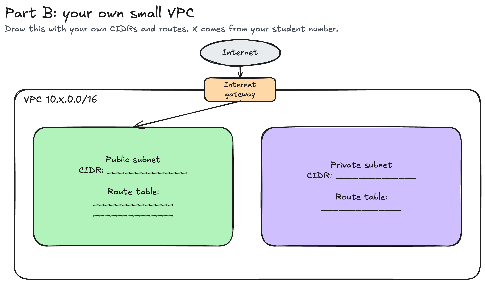

# Assignment 2: Explore a VPC

This is a self-guided activity. It prepares you for the VPC topics. A VPC is the network that your servers run in.

Work through this page from top to bottom. Read the glossary, then read each concept section in order. Each section uses the terms from the sections before it. When you finish, follow the steps in [`assignment.md`](assignment.md).

## What you do

This is individual work. The activity has two parts:

- **Part A. Explore.** You sign in to the AWS console and look at the default VPC of the class AWS account. You record what you find. You do not create, change, or delete anything.
- **Part B. Prepare.** You plan and draw a small VPC, predict what happens when a route changes, and write one question about VPCs. Your address range comes from your student number, so your answers are different from your classmates' answers.

Part B uses a number called X. X is the last two digits of your student number plus 100, so it is a number from 100 to 199. X becomes the second number of your VPC address range. For example, a student number that ends in `50` gives X = 150 and the VPC `10.150.0.0/16`. Because X comes from your student number, your Part B answers are your own.

You sign in with the IAM user of your Lab group, the same user from Lab 1 and Lab 2. Your groupmates can sign in with the same user at the same time. Do not change the group password. A new password locks out your groupmates.

You submit your work as a Pull Request to your section repository, like the earlier activities. Then you submit the Pull Request link in the class Google Form. The steps, the deadline, and the form link are in [`assignment.md`](assignment.md).

## Glossary

Read these terms first. The concept sections explain them in the same order.

| Term | Meaning |
| --- | --- |
| Region | A geographic area with AWS data centers. The class uses `ap-southeast-1`, Singapore. |
| Availability Zone (AZ) | One or more data centers inside a Region, with separate power and networking. |
| VPC (Virtual Private Cloud) | A private network that you own inside one Region. |
| Default VPC | The VPC that AWS creates in every Region of an account. Your Lab 2 instances ran in it. |
| IP address | The number that identifies one device on a network, for example `10.0.1.25`. |
| IPv4 | The common address format: four numbers from 0 to 255, separated by dots. |
| Private address range | An address range for internal networks only, for example `10.0.0.0/8` or `172.16.0.0/12`. |
| CIDR block | A range of IP addresses, written as an address, a slash, and a prefix length, for example `10.0.0.0/16`. |
| Prefix length | The number after the slash. A larger number means a smaller range. |
| Subnet | A smaller address range inside a VPC. Each subnet is in exactly one AZ. |
| Reserved addresses | The 5 addresses in every subnet that AWS keeps for itself. |
| Network interface | The virtual network card of an instance. It holds one address from a subnet. |
| Internet gateway | The connection between a VPC and the internet. |
| Route | A rule that says where traffic for a destination range goes. |
| Route table | The list of routes that a subnet uses. |
| Local route | The route in every route table that connects all subnets of the VPC. |
| Public subnet | A subnet whose route table sends `0.0.0.0/0` to an internet gateway. |
| Private subnet | A subnet with no route to an internet gateway. |
| NAT gateway | A service that lets a private subnet start connections to the internet, but not receive them. |
| Port | A number that identifies a service on a server, for example 80 for HTTP. |
| Inbound and outbound | Traffic that comes in to a resource, and traffic that goes out of it. |
| Security group | A firewall on a resource, such as an instance. It has allow rules only. |
| Network ACL | A firewall on a subnet. It has allow rules and deny rules. |
| Stateful | Remembers a request, so the reply goes back out without a separate rule. |
| Stateless | Does not remember requests, so each direction needs its own rule. |

## Concepts

### 1. Why a server needs a network

In Lab 2 you launched an EC2 instance and opened its web page from your laptop. That worked because the instance had three things:

1. An address, so that traffic can find it.
2. A path between the internet and that address.
3. A rule that lets the traffic in.

A VPC gives an instance all three. Your account already had a default VPC, so Lab 2 worked without any network setup. In this activity, you look inside that VPC.

### 2. Regions and Availability Zones

A Region holds several Availability Zones. Each AZ has its own power and networking, so a problem in one AZ does not stop the others. The Singapore Region has three AZs: `ap-southeast-1a`, `ap-southeast-1b`, and `ap-southeast-1c`.

A VPC covers a whole Region. The subnets inside it each sit in one AZ.

### 3. The parts of a VPC

This diagram shows a complete VPC. You do not need to understand every label yet. Sections 4 to 13 explain each part. Come back to this diagram after each section.

### 4. IP addresses and private ranges

Every device on a network has an IP address. An IPv4 address is four numbers from 0 to 255, separated by dots, for example `10.0.1.25`.

Some address ranges are for private networks only. Routers on the internet do not carry traffic for these ranges. A VPC uses one of them:

- `10.0.0.0` to `10.255.255.255`
- `172.16.0.0` to `172.31.255.255`
- `192.168.0.0` to `192.168.255.255`

Many companies use the same private range inside their own VPCs. The internet does not mix them up, because the internet never routes these addresses.

### 5. CIDR blocks

A CIDR block is a way to write an address range, for example `10.0.0.0/16`. An IPv4 address has 32 bits. The prefix length after the slash tells you how many bits are fixed. The other bits are free. Each free bit doubles the number of addresses.

| CIDR prefix | Free bits | Addresses in the block | Example range |
| --- | --- | --- | --- |
| `/16` | 16 | 65,536 | `10.0.0.0` to `10.0.255.255` |
| `/20` | 12 | 4,096 | `10.0.0.0` to `10.0.15.255` |
| `/24` | 8 | 256 | `10.0.1.0` to `10.0.1.255` |
| `/28` | 4 | 16 | `10.0.1.0` to `10.0.1.15` |

A larger prefix length means a smaller range.

### 6. Subnets

A subnet is a smaller range inside the VPC range. For example, the VPC `10.0.0.0/16` can hold the subnets `10.0.1.0/24` and `10.0.2.0/24`. Each subnet is in exactly one AZ. A real design puts subnets in at least two AZs, so that the application keeps working if one AZ fails.

Two rules apply to subnets:

1. A subnet must fit inside the VPC range.
2. Two subnets in the same VPC must not overlap. For example, `10.0.0.0/24` ends at `10.0.0.255`, so the next `/24` starts at `10.0.1.0`.

AWS keeps 5 addresses in every subnet: the first four and the last one. Instances cannot use them. A `/24` subnet has 256 addresses, so 251 are usable. A `/20` subnet has 4,096 addresses, so 4,091 are usable.

An instance gets its address through a network interface. The network interface keeps its address while the instance is stopped. A stopped instance still uses one address in its subnet.

### 7. The internet gateway

A new VPC has no connection to the internet. An internet gateway is that connection. You attach one internet gateway to a VPC.

An attached internet gateway does not open anything by itself. A subnet uses the gateway only when the route table of the subnet sends traffic to it. Section 8 explains route tables.

### 8. Route tables

Each subnet uses one route table. A route table is a list of routes. Each route has a destination range and a target. When an instance sends traffic, AWS uses the route with the most specific destination that matches.

Every route table has a local route. Its destination is the VPC range, and its target is `local`. The local route lets every subnet reach every other subnet in the VPC.

The destination `0.0.0.0/0` matches every address. A route with this destination catches all traffic that no other route matches. In practice, that traffic is internet traffic.

### 9. Public and private subnets

The route table decides whether a subnet is public or private:

- A public subnet has a route `0.0.0.0/0` to the internet gateway. An instance in it with a public IP address can reach the internet, and the internet can reach the instance.
- A private subnet has no route to the internet gateway. The internet cannot reach the instances in it. A database belongs in a private subnet.

The name of a subnet does not make it public. A subnet named `public` with no internet gateway route is private.

### 10. The NAT gateway

Some servers in a private subnet must download updates from the internet, but must not accept connections from it. A NAT gateway (Network Address Translation gateway) solves this:

1. The NAT gateway sits in a public subnet.
2. The private route table sends `0.0.0.0/0` to the NAT gateway.
3. A server in the private subnet starts a connection out, and the reply comes back.
4. Nobody on the internet can start a connection in.

A NAT gateway costs money for every hour that it runs. The class account has none.

Follow this diagram from left to right. It shows how a route table handles one packet.

### 11. Ports

A server can run several services at the same time. A port number tells the server which service the traffic is for. Firewall rules use ports.

| Protocol or service | Port |
| --- | --- |
| SSH (remote login) | 22 |
| HTTP | 80 |
| HTTPS | 443 |
| MySQL | 3306 |

### 12. Security groups

A route makes a path. A firewall decides which traffic can use that path. A security group is a firewall on one resource, such as an instance, a load balancer, or a database. It works like this:

- It has allow rules only. A security group blocks all traffic that no rule allows.
- An inbound rule names a port and a source. The source is an address range or another security group.
- It is stateful. If it lets a request in, the reply goes back out without an outbound rule.

In Lab 2 you wrote an inbound rule that allowed HTTP, port 80, from `0.0.0.0/0`. That source means any address.

A rule can name another security group as its source. Then only the resources in that security group can send the traffic. A layered design uses this, so that each tier accepts traffic only from the tier in front of it.

### 13. Network ACLs

A network ACL (access control list) is a second firewall. It works on a whole subnet, not on one resource.

| | Security group | Network ACL |
| --- | --- | --- |
| Attaches to | A resource, such as an instance | A subnet |
| Rule types | Allow rules only | Allow rules and deny rules |
| Replies | Stateful. The reply goes out without a rule. | Stateless. Each direction needs its own rule. |
| Rule order | AWS checks all rules together | AWS checks rules by number, lowest first, and stops at the first match |

The default network ACL allows all traffic in both directions. Most designs keep this default and put the detailed rules in security groups.

### 14. Read the whole VPC

Go back to the diagram in section 3. You can now read every part of it:

1. The VPC `10.0.0.0/16` is in one Region.
2. It has four `/24` subnets, two in each AZ.
3. The internet gateway connects the VPC to the internet.
4. The public subnets have a route `0.0.0.0/0` to the internet gateway. The private subnets have only the local route.
5. Security groups and network ACLs decide which traffic can use those paths.

In Part A, you find each of these parts in the default VPC of the class account.

### 15. Where to look in the console

Part A uses only the pages in this map. The group user can read these pages. It cannot create, change, or delete anything.

### 16. Your plan in Part B

In Part B, you plan and draw a VPC with one public subnet and one private subnet. Use this diagram as the starting point for your drawing.

## Files in this folder

| File | What it is |
| --- | --- |
| [`README.md`](README.md) | This page: the glossary and the concepts. |
| [`assignment.md`](assignment.md) | The steps, the questions, the scoring, and how to submit. |
| [`submission-template.md`](submission-template.md) | Every question, with an `<answer>` placeholder. Copy it to your submission folder as `submission.md`. |
| [`sample-submission.md`](sample-submission.md) | A complete `submission.md` for a made-up student and a made-up account. It shows the format and the level of detail. |
| [`diagrams/`](diagrams/) | The diagrams on this page, as PNG images and as `.excalidraw` files that you can open at <https://excalidraw.com>. |
