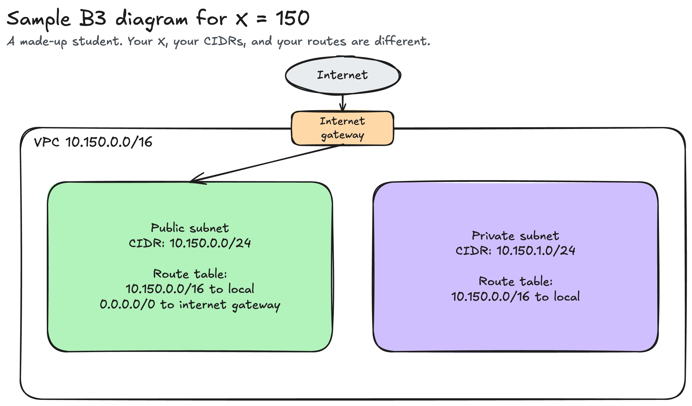

# Assignment 2 sample submission

This example shows a complete `submission.md`. Use it to see the format and the level of detail. Do not copy its values.

- The student is made up. Their X is 150.
- The AWS account is made up. It is in the Oregon Region (`us-west-2`), not Singapore. It has four subnets, one NAT gateway, and an extra network ACL rule.
- Your Part A answers come from the class AWS account in Singapore. Your Part B answers come from your own X.

The example student's folder looks like this:

```text
submissions/assignment-2/jdelacruz/
├── submission.md
├── screenshot-1-subnets.png
├── screenshot-2-routes.png
├── screenshot-3-network-acl.png
└── vpc-diagram.png
```

Everything below this line is the content of that `submission.md`.

---

## About me

- GitHub username: jdelacruz
- Section: IV-XCSAD (made up)
- IAM user name that I signed in with: `xcsad-g00` (made up)
- X: 150

---

## Part A. Explore

### A1. The VPC

Default VPC IPv4 CIDR:

`172.31.0.0/16`

Number of addresses in that CIDR:

65,536

### A2. The subnets

| Availability Zone | IPv4 CIDR |
| --- | --- |
| `us-west-2a` | `172.31.32.0/20` |
| `us-west-2b` | `172.31.16.0/20` |
| `us-west-2c` | `172.31.0.0/20` |
| `us-west-2d` | `172.31.48.0/20` |

Screenshot 1. In a real submission, the subnet list appears here. The top bar of the console is cropped out.

### A3. Available addresses

Available IPv4 addresses in each subnet:

`us-west-2a` 4,091, `us-west-2b` 4,088, `us-west-2c` 4,091, `us-west-2d` 4,091.

Why is the number lower than 4,096?

A `/20` has 4,096 addresses. AWS reserves 5 addresses in every subnet. An empty subnet has 4,096 − 5 = 4,091 available addresses.

What uses the missing address in the subnet with the lowest number?

`us-west-2b` has 3 fewer addresses than the others. Three network interfaces hold one address each. Two belong to instances, and one belongs to the NAT gateway.

### A4. The route table

| Destination | Target |
| --- | --- |
| `172.31.0.0/16` | `local` |
| `0.0.0.0/0` | `igw-...` |

Screenshot 2. In a real submission, the Routes tab appears here.

### A5. Public or private

Are the default subnets public or private? Which route proves it?

Public. The route `0.0.0.0/0` sends traffic to the internet gateway.

### A6. The internet gateway

State of the internet gateway:

Attached

What happens to the default subnets if the gateway is detached?

The route `0.0.0.0/0` has no working target. The subnets lose their path to the internet. The instances can still reach each other through the local route.

### A7. NAT gateways

Number of NAT gateways:

1

Can a server in a new private subnet download updates? Why?

Not yet. A new private subnet uses a route table with the local route only. The server can download updates after its route table gets the route `0.0.0.0/0` to the NAT gateway.

### A8. The network ACL

| Rule number | Source | Allow or Deny |
| --- | --- | --- |
| 90 | `203.0.113.0/24` | Deny |
| 100 | `0.0.0.0/0` | Allow |
| `*` | `0.0.0.0/0` | Deny |

How is a network ACL different from a security group?

A network ACL protects a whole subnet. A security group protects one resource. A network ACL is stateless, so reply traffic needs its own outbound rule. A network ACL can also deny traffic. Here, rule 90 blocks one address range before rule 100 allows everything else.

Screenshot 3. In a real submission, the Inbound rules tab appears here.

### A9. The default security group

Inbound rule (type and source):

All traffic, from `sg-...`. The source is the `default` security group itself.

Which resources can send traffic to an instance that uses it?

Only resources that also use the `default` security group. No other inbound rule exists, so the security group blocks traffic from every other source.

---

## Part B. Prepare

### B1. Plan two subnets

- Public subnet CIDR: `10.150.0.0/24`
- Private subnet CIDR: `10.150.1.0/24`

### B2. Route tables

Route table of the public subnet:

| Destination | Target |
| --- | --- |
| `10.150.0.0/16` | `local` |
| `0.0.0.0/0` | internet gateway |

Route table of the private subnet:

| Destination | Target |
| --- | --- |
| `10.150.0.0/16` | `local` |

### B3. My VPC diagram

Tool used (Excalidraw, draw.io, Lucidchart, or paper):

Excalidraw



In a real `submission.md`, this image line is ``. To see how the example diagram is built, open [`diagrams/a2-06-sample-plan.excalidraw`](diagrams/a2-06-sample-plan.excalidraw) in Excalidraw. Draw your own diagram with your own X.

### B4. Predict a change

Can you still open the web page from your laptop? Why?

No. The laptop is on the internet. Without the route `0.0.0.0/0`, traffic between the instance and an internet address has no route. A public IP address alone is not enough.

Can the instance still reach another instance in the VPC? Why?

Yes. The local route for the VPC range is still in the route table. It connects every subnet in the VPC.

### B5. Place a database

Which subnet gets the database? Why?

The private subnet, `10.150.1.0/24`. Its route table has no route to the internet gateway, so nobody on the internet can reach the database.

### B6. My question about VPCs

What is your question, and what made you think of it?

Can two VPCs in the same account talk to each other, and must their CIDRs be different? I thought of it because many accounts use the same default range, `172.31.0.0/16`.
