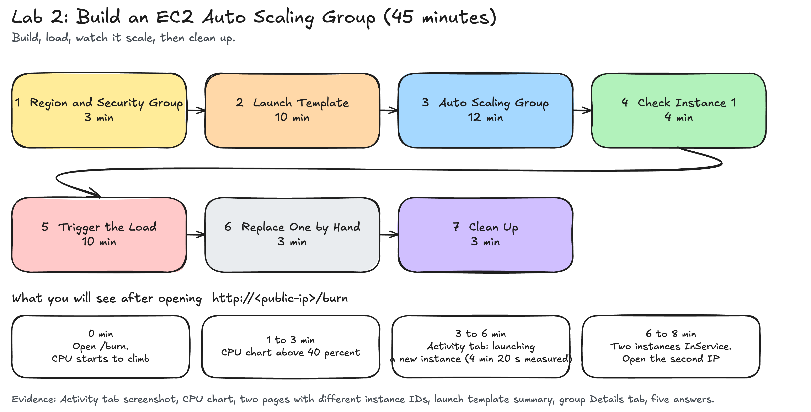

# EC2 Auto Scaling Group Lab

This lab shows you how to build a group of servers that automatically adds instances when load rises and removes them when load drops.

## What you build

You launch a single EC2 instance and place it inside an Auto Scaling Group. You define a target tracking policy tied to CPU utilization. When you run a stress test script to artificially load the CPU, the group breaches your assigned threshold. The Auto Scaling Group launches a second instance to distribute the load.

## Reference Architecture

**How the components interact:**
1. **User Request:** You send HTTP traffic to the instance's public IP address.
2. **Stress Script:** The `/burn` endpoint runs a script that forces the CPU to 100%.
3. **CloudWatch Alarm:** The Auto Scaling target tracking policy monitors average CPU utilization. When the group average crosses your assigned threshold (e.g., 40%), the alarm enters the `In alarm` state.
4. **Auto Scaling Group:** The alarm triggers a scale-out event. The group reads the Launch Template and provisions a new `t3.micro` instance in a second Availability Zone.

## Why this matters

A single server is a single point of failure and a bottleneck. If traffic spikes, the server crashes. If you provision ten servers permanently to handle rare spikes, you waste money. 

Auto Scaling links capacity to demand. You pay for more servers only when you need them. The target tracking policy acts as a thermostat: you set the desired temperature (CPU utilization), and AWS adds or removes instances to maintain it.

## Submissions and Proof

You must prove that your setup worked. A written report without evidence is not enough. Your submission must include:
1. **Activity History:** A screenshot showing the Auto Scaling group's Activity history when the second instance launched.
2. **CloudWatch Alarm:** A screenshot of your target tracking alarm in the "In alarm" state.

See `lab.md` for the exact steps and your assigned group parameters.
