# Lab 2: Build an EC2 Auto Scaling Group

> **Submission format:** This lab requires a Pull Request (PR) containing your `contribution.md`, `submission.md`, and proof screenshots. Once your PR is open, submit its link to the Google Form for peer evaluation: https://forms.gle/RXFYNovBxpX4bA6z9. Do not merge your own PR.

**Goal:** Build a group of servers that adds a server when load rises, and watch it happen.

**Prerequisites:** Lab 1 finished. I have unlocked Auto Scaling for your section. The User-Data text in this folder, [`lab2-user-data.sh`](lab2-user-data.sh).

**Duration:** 45 minutes. Answer the questions only after Step 7.

## Team Parameters

To prevent duplication, each team must use their assigned CPU utilization threshold for the Auto Scaling target tracking policy (instead of the default 40%).

| Team | CPU Target Value |
|---|---|
| Group 1 | 30 |
| Group 2 | 35 |
| Group 3 | 40 |
| Group 4 | 45 |
| Group 5 | 50 |
| Group 6 | 55 |
| Group 7 | 60 |
| Group 8 | 65 |
| Group 9 | 70 |
| Group 10 | 75 |
| Group 11 | 80 |
| Group 12 | 85 |

## How the lab works

```
You (browser)
   |  http://<public-ip>/burn
   v
Instance 1 (t3.micro) ----- CPU rises above your assigned threshold
   |                            |
   |                    CloudWatch alarm (created by the scaling policy)
   |                            |
   |                    Auto Scaling group: desired 1 -> 2 (maximum is 2)
   |                            |
   |                            v
   |                     Instance 2 launches in another Availability Zone
   +--> Each page shows its instance ID and Availability Zone
```

There is no load balancer this week. You open each instance by its public IP.

## Steps

In every step, replace `<user>` with your IAM user name.

**1. Confirm the Region and the security group (3 minutes).**

1. Check that the top bar shows Asia Pacific (Singapore).
   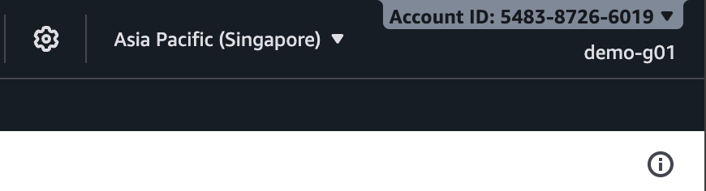
2. Open EC2, then Security Groups. Look for a security group named `<user>-web`.
   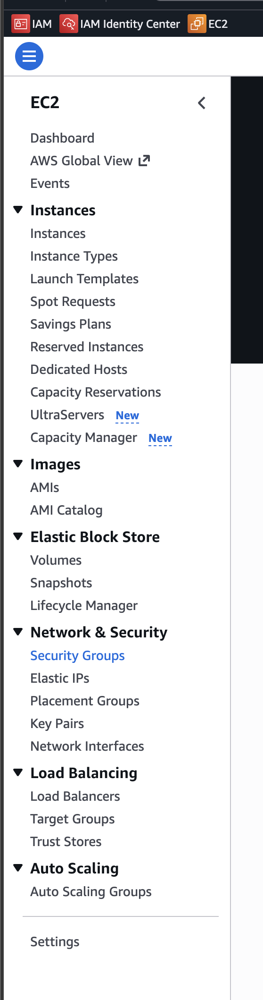
   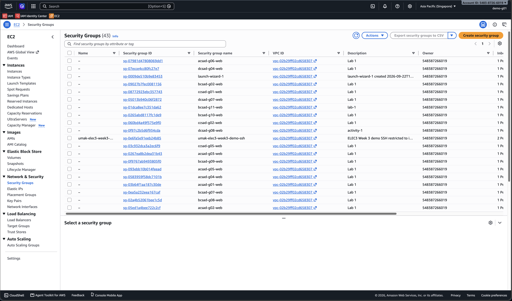
3. If it already exists from Lab 1, keep it. Select it, open the Inbound rules tab, and confirm one rule: HTTP, port 80, source `0.0.0.0/0`. If the rule is missing, click Edit inbound rules, Add rule, then Save rules. You are done with Step 1.
4. If it does not exist, click **Create security group**.
5. Name it `<user>-web` and set the Description to `Lab 2`. Leave VPC as default.
6. Under Inbound rules, click Add rule. Set Type to HTTP, Port range to 80, and Source to `0.0.0.0/0`.
   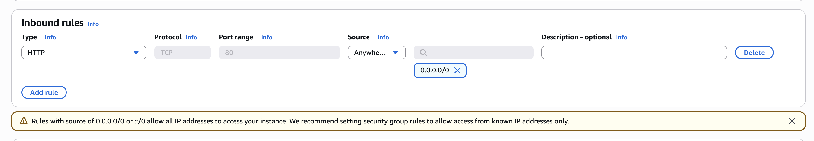
7. Under Outbound rules, leave the default (All traffic, All ports, `0.0.0.0/0`) as is.
8. Under Tags, click Add new tag. Set Key to `team` and Value to `<user>`.
   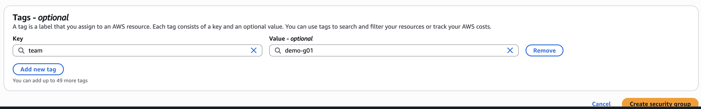
9. Click **Create security group**.
   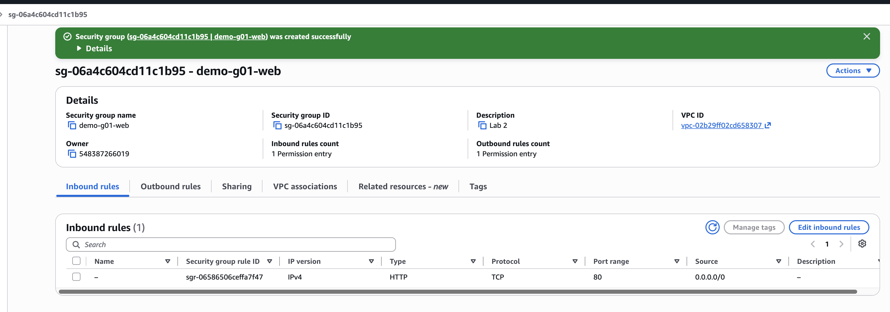

**2. Create the launch template (10 minutes).**

1. Open EC2, then Launch Templates, then Create launch template.
   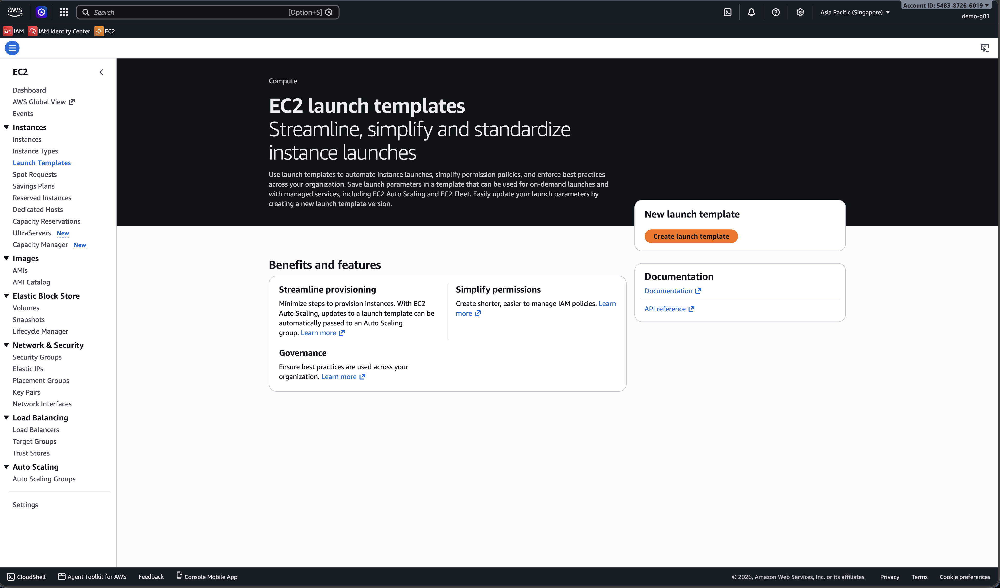
2. Launch template name: `<user>-lt`. Template version description: `Lab 2`.
3. Tick Provide guidance to help me set up a template that I can use with EC2 Auto Scaling.
   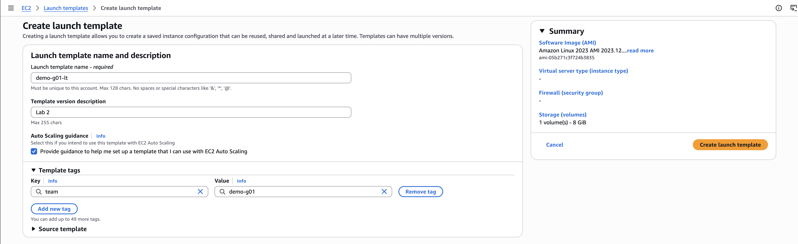
4. Under Template tags, add Key `team`, Value `<user>`.
   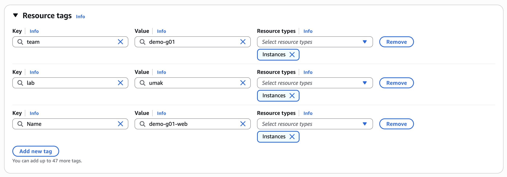
5. Application and OS Images: choose Quick Start, then Amazon Linux 2023 AMI.
   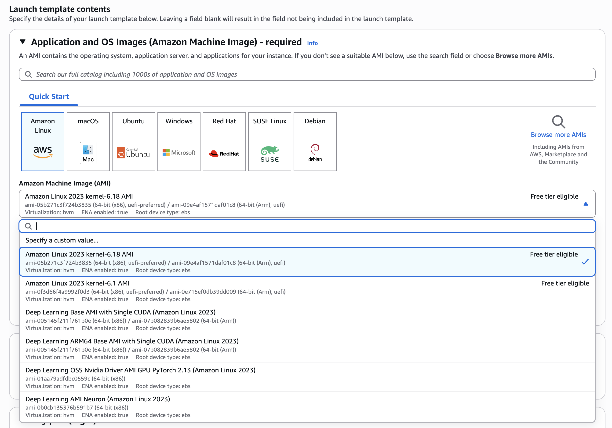
6. Instance type: `t3.micro`.
   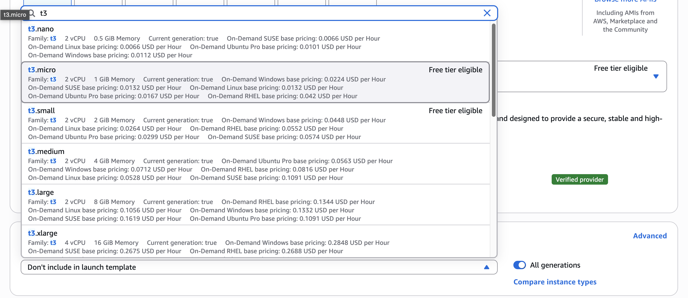
7. Key pair: Don't include in launch template.
8. Network settings: leave Subnet as Don't include in launch template. Under Security groups, choose `<user>-web`.
   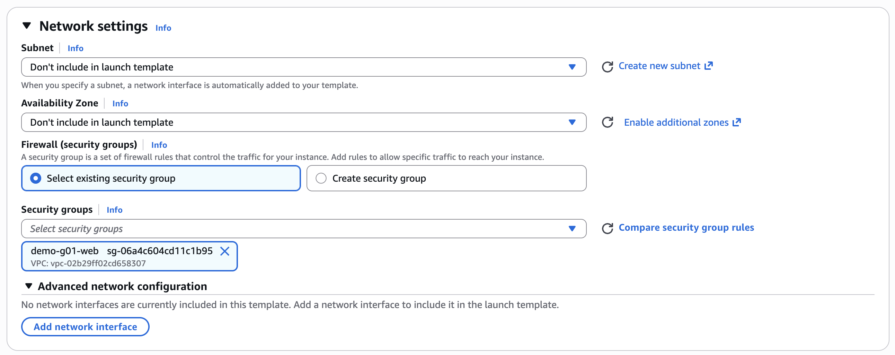
9. Under Resource tags, click Add tag three times. Use Key `team` Value `<user>`, Key `lab` Value `umak`, and Key `Name` Value `<user>-web`. Set Resource type to Instances for each.
10. Open Advanced details. Set Detailed CloudWatch monitoring to Enable.
   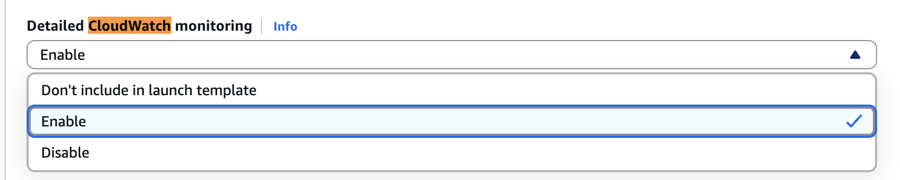
11. Scroll to User data. Paste the full text of `lab2-user-data.sh`.
    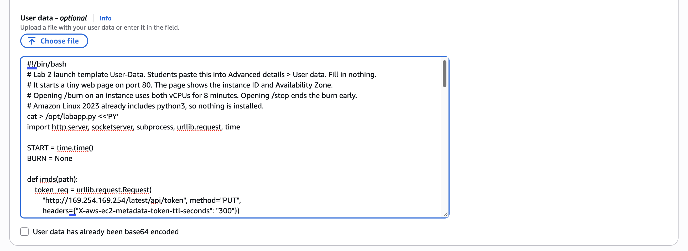
12. Click Create launch template. Confirm the success message.
    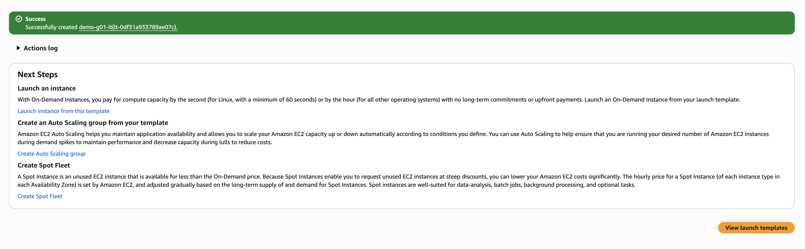

**3. Create the Auto Scaling group (12 minutes).**

1. Open EC2, then Auto Scaling Groups, then Create Auto Scaling group.
2. Step 1: Name `<user>-asg`. Launch template: `<user>-lt`. Version: Latest. Click Next.
   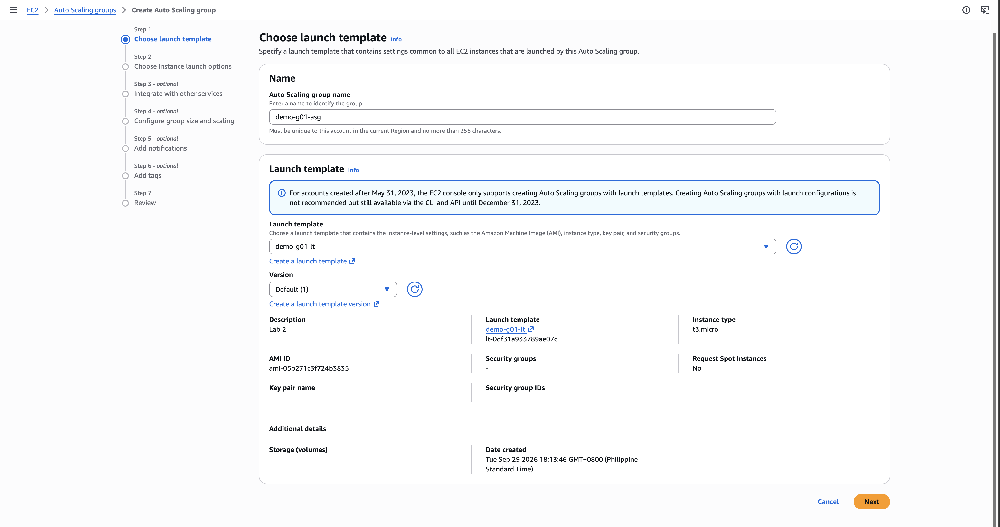
3. Step 2: VPC: the default VPC. Availability Zones and subnets: select two subnets in different Availability Zones. Click Next.
   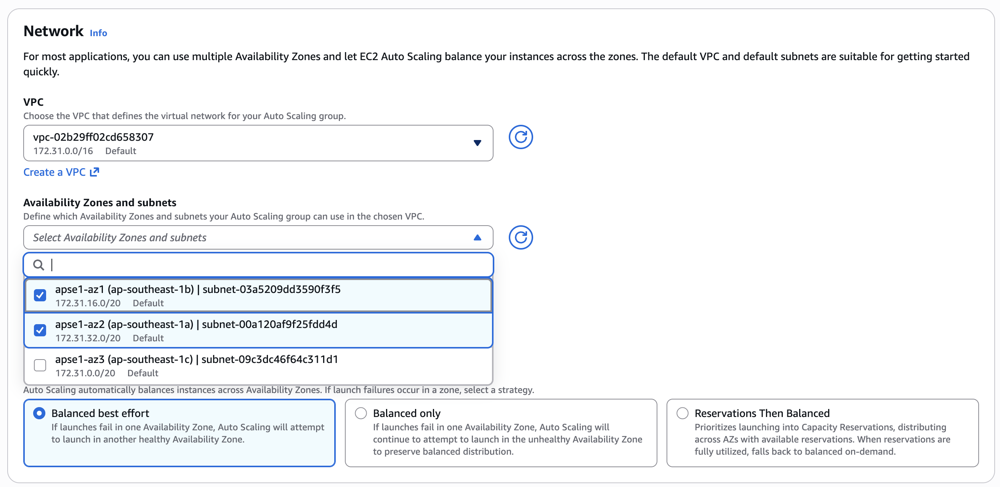
4. Step 3: Load balancing: No load balancer. Health checks: leave EC2. Under Additional settings, tick Enable group metrics collection within CloudWatch. Click Next.
   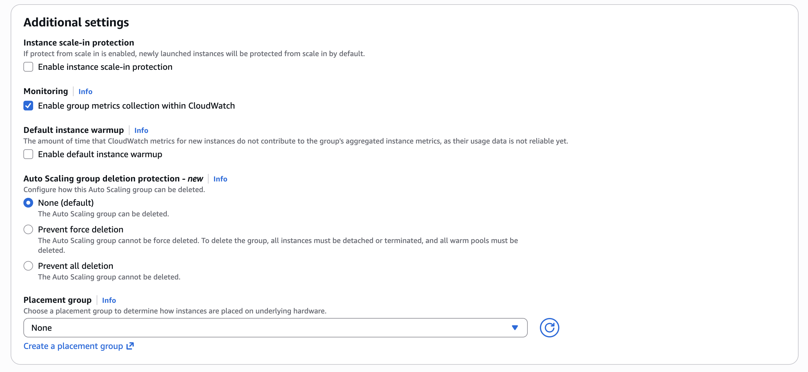
5. Step 4: Desired capacity `1`, Minimum capacity `1`, Maximum capacity `2`. Under Scaling policies, choose Target tracking scaling policy. Metric type: Average CPU utilization. Target value: `<your-assigned-target-value>`. Instance warmup: `60` seconds. Click Next.
   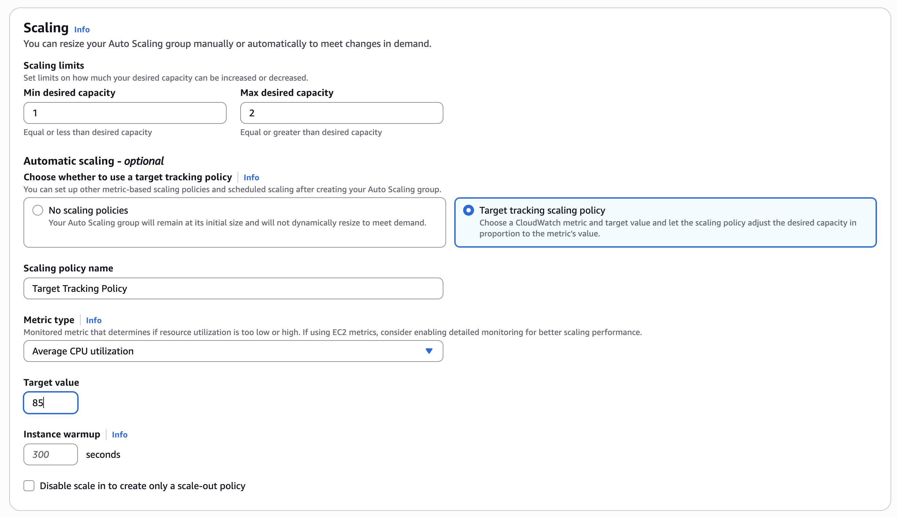
6. Step 5: Add notifications. Click Next without changes.
7. Step 6: Add tags. Click Add tag. Key `team`, Value `<user>`, and tick Tag new instances. Add a second tag: Key `lab`, Value `umak`, and tick Tag new instances. Click Next.
   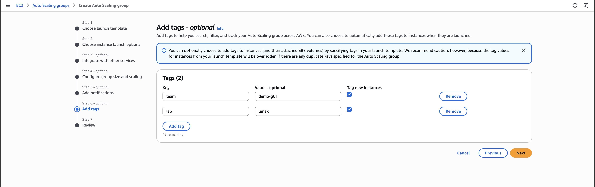
8. Step 7: Review. Click Create Auto Scaling group.
   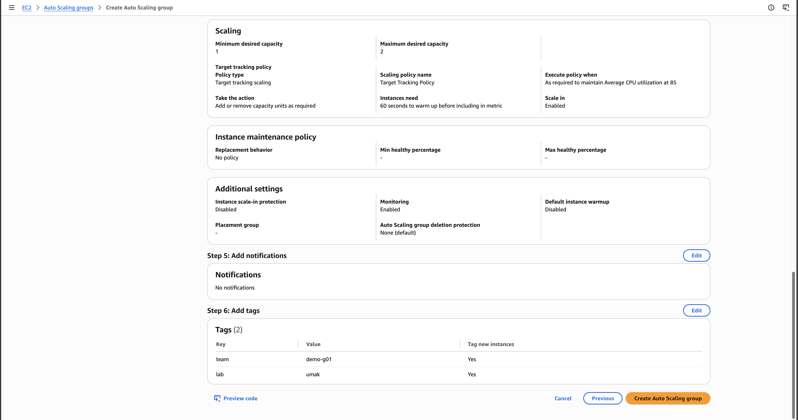

If creation fails, copy the full error text. Read the action and the resource in it. Tell me the action name.

**4. Check the first instance (4 minutes).**

1. Open the group `<user>-asg`, then the Instance management tab.
   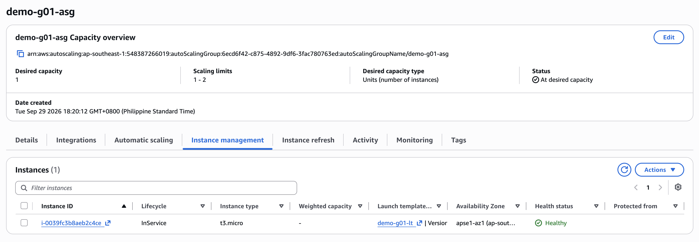
2. Wait until one instance shows Lifecycle InService.
3. Click the instance ID. Copy the Public IPv4 address.
   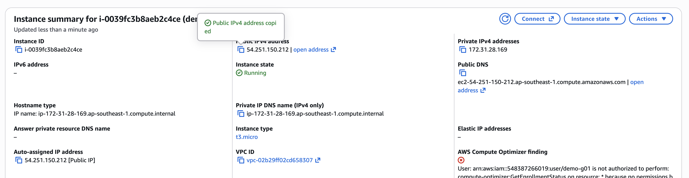
4. Open `http://<public-ip>` in a new browser tab. Use http, not https.
   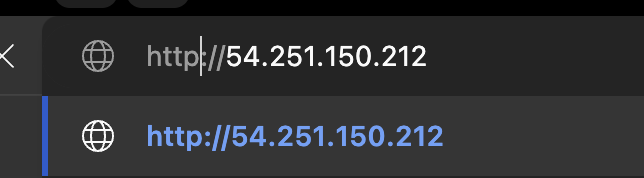
5. Write down the instance ID and the Availability Zone shown on the page in your `submission.md`.

**5. Trigger the load (10 minutes).**

1. Open `http://<public-ip>/burn`. The page says it is burning both vCPUs.
2. On the group page, open the Monitoring tab, then EC2. Watch Average CPU utilization. It rises in one to three minutes.
   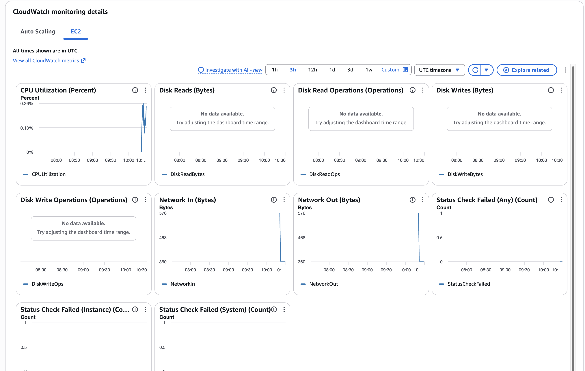
3. Open the Activity tab. Wait for a line that says a new instance is launching. Expect this in three to six minutes. Take a screenshot of this Activity History as proof.
   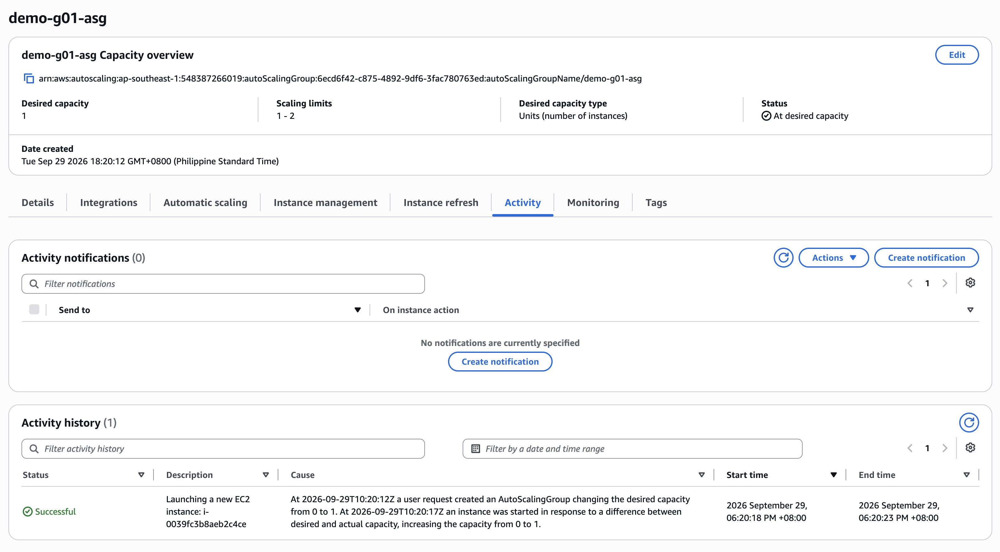
4. On the Instance management tab, wait until two instances are InService.
   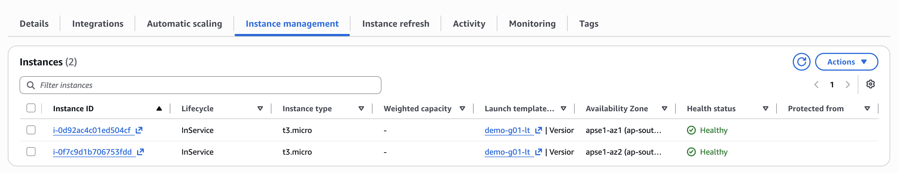
5. Open the second instance's public IP in a new tab. Write down its instance ID and Availability Zone in your `submission.md`.
6. Open `http://<first-public-ip>/stop` to end the load on the first instance.
7. Open the Monitoring tab of the group and look at the CPU chart. Take a screenshot of the CloudWatch Alarm or the CPU utilization chart as proof.
   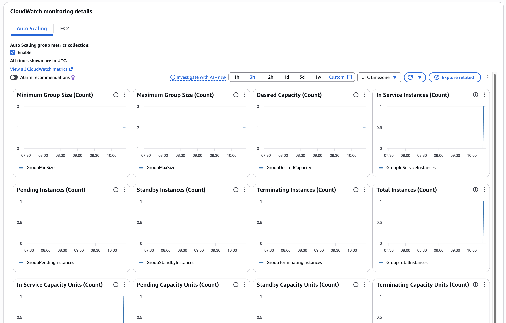
8. Open the Activity tab of the group.

The group will not shrink during class. Scale-in waits about fifteen minutes of low CPU. The automatic cutoff ends the group before then if you do nothing.

**6. Replace an instance by hand (3 minutes).**

1. Open EC2, then Instances. Select one of the two group instances. Choose Instance state, then Terminate (delete) instance.
2. Open the group's Activity tab. Watch the group launch a replacement.

**7. Clean up (3 minutes).**

1. Open EC2, Auto Scaling Groups. Select `<user>-asg`, choose Delete, type `delete`, and confirm.
2. Open EC2, Launch Templates. Select `<user>-lt`, choose Actions, then Delete template, and confirm.
3. Open EC2, Security Groups. Select `<user>-web`, choose Actions, then Delete security group. It can take a minute to delete while instances shut down. Retry after one minute.

## Questions and evidence

Answer after Step 7.

1. Why did the group stop at 2 instances?
2. Why did terminating an instance by hand not remove the cost?
3. Why is the target value set to your assigned value (e.g., 30-85 percent) instead of 99 percent?
4. What did the automatic cutoff protect us from?
5. What changes when a load balancer sits in front of the group?

## Final PR Checklist

Your Pull Request must contain:
1. `contribution.md`: A markdown table showing who played which role (Driver, Navigator, Recorder, Reviewer) in each part of the lab. You can copy `contribution-template.md` to start.
2. `submission.md`: The file containing your recorded instance IDs and your answers to the 5 questions. You can copy `submission-template.md` to start.
3. **Proof screenshots**: Attach your screenshots of the Activity History and CloudWatch Alarm directly in your PR or in a folder in the PR.

*Tip: Check out `submission-example.md` in this folder to see what a finished submission should look like.*

**Expected output:** A group that grows from 1 to 2 instances within about 6 minutes of `/burn`. Two different instance IDs. One replacement instance after you terminate one by hand.
