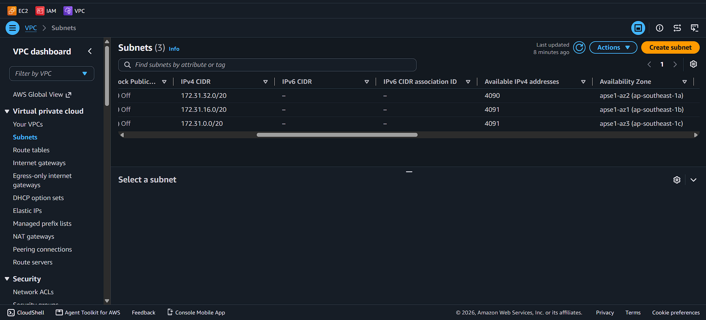
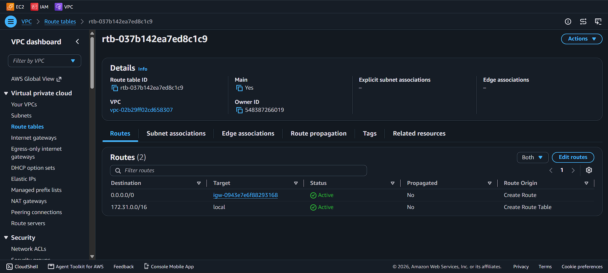
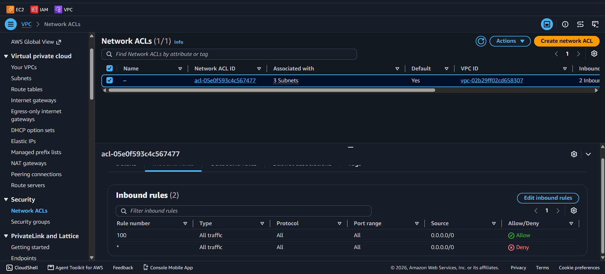
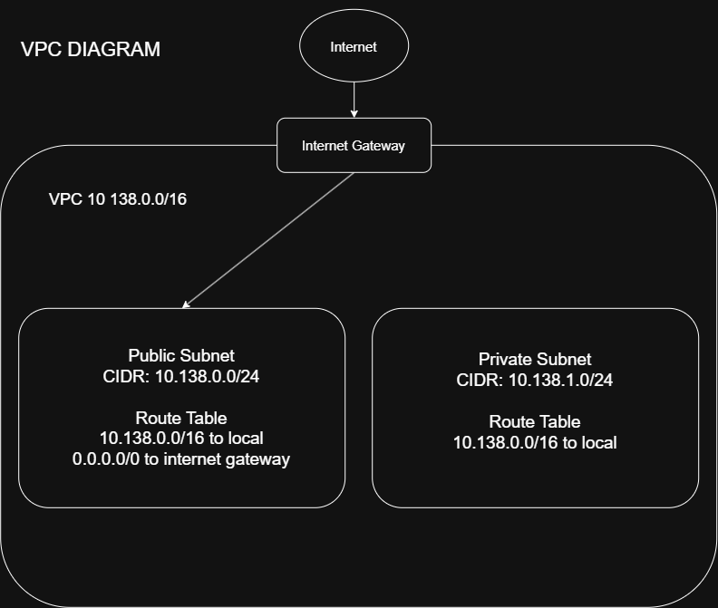

# Assignment 2 Submission

<!--
How to use this template:

1. Copy this file to submissions/assignment-2/<your-github-username>/submission.md
2. Replace every answer placeholder with your own answer. Delete the angle brackets too.
3. Save your four images in the same folder, with the exact file names below.
4. Do not write your full name or your student number in this file.
-->

## About me

- GitHub username: yoonice0393
- Section: IV-ACSAD
- IAM user name that I signed in with: acsad-g07
- X: 138

---

## Part A. Explore

### A1. The VPC

Default VPC IPv4 CIDR:

172.31.0.0/16

Number of addresses in that CIDR:

65,536

### A2. The subnets

| Availability Zone | IPv4 CIDR |
| --- | --- |
| apse1-az2 (ap-southeast-1a) | 172.31.32.0/20 |
| apse1-az1 (ap-southeast-1b) | 172.31.16.0/20 |
| apse1-az3 (ap-southeast-1c) | 172.31.0.0/20  |

Screenshot 1. Save it as `screenshot-1-subnets.png` in your folder. The image line below shows it.

### A3. Available addresses

Available IPv4 addresses in each subnet:

`apse1-az2` 4090, `apse1-az1` 4091, `apse1-az3` 4091

Why is the number lower than 4,096?

Each subnet has 4,096 total IPv4 addresses, but AWS reserves 5 IP addresses in every subnet for networking purposes. Therefore, only 4,091 are normally available.

What uses the missing address in the subnet with the lowest number?

The subnet with 4,090 available addresses has one additional IP address already assigned/in use, in addition to the 5 AWS-reserved addresses. This is typically used by a resource such as a network interface (ENI).

### A4. The route table

| Destination | Target |
| --- | --- |
| 0.0.0.0/0 | igw-0943e7e6f88293168 |
| 172.31.0.0/16 | local |

Screenshot 2. Save it as `screenshot-2-routes.png` in your folder. The image line below shows it.

### A5. Public or private

Are the default subnets public or private? Which route proves it?

The default subnets are public because their route table contains a route to 0.0.0.0/0 through the Internet Gateway (igw). This allows resources in the subnet to communicate with the internet.

### A6. The internet gateway

State of the internet gateway:  

Attached

What happens to the default subnets if the gateway is detached?  

The default subnets become private from an internet connectivity perspective because their 0.0.0.0/0 route points to an Internet Gateway that is no longer attached to the VPC. Resources in those subnets can no longer access the internet directly through the Internet Gateway.

### A7. NAT gateways

Number of NAT gateways:  

0

Can a server in a new private subnet download updates? Why?  

No. A server in a private subnet cannot directly access the internet because there is no NAT Gateway to provide outbound internet connectivity. The private subnet also does not have a direct route to the Internet Gateway.

### A8. The network ACL

| Rule number | Source | Allow or Deny |
| --- | --- | --- |
| 100 | 0.0.0.0/0 | Allow |
| * | 0.0.0.0/0 | Deny |

How is a network ACL different from a security group?

A network ACL (NACL) controls traffic at the subnet level, while a security group controls traffic at the instance/resource level. NACLs are stateless and can have both allow and deny rules, while security groups are stateful and only have allow rules.

Screenshot 3. Save it as `screenshot-3-network-acl.png` in your folder. The image line below shows it.

### A9. The default security group

Inbound rule (type and source):

All traffic, from `sg-0c5b6d4081cf0a534 - default` 

Which resources can send traffic to an instance that uses it?  

Only resources/instances that are associated with the same security group (sg-0c5b6d4081cf0a534) can send inbound traffic to the instance.

---

## Part B. Prepare

### B1. Plan two subnets

- Public subnet CIDR: `10.138.0.0/24`
- Private subnet CIDR: `10.138.1.0/24`

### B2. Route tables

Route table of the public subnet:

| Destination | Target |
| --- | --- |
| `10.138.0.0/16` | local |
| `0.0.0.0/0` | internet gateway |

Route table of the private subnet:

| Destination | Target |
| --- | --- |
| `10.138.0.0/16| local |

### B3. My VPC diagram

Tool used (Excalidraw, draw.io, Lucidchart, or paper):

draw.io

Save your diagram as `vpc-diagram.png` in your folder. The image line below shows it.

### B4. Predict a change

Can you still open the web page from your laptop? Why?

No. The instance still has a public IP, but with the 0.0.0.0/0 route gone, nothing tells the subnet to send traffic to the internet gateway. Your request may arrive, but the instance's replies have no route back out to your laptop, so the page does not load.

Can the instance still reach another instance in the VPC? Why?

es. The local route for the VPC CIDR is always in every route table and cannot be deleted. Traffic inside the VPC uses it and never needs the internet gateway. Security groups must still allow the traffic.

### B5. Place a database

Which subnet gets the database? Why?

The private subnet `10.138.1.0.0/24`A database should not be reachable from the internet. In the private subnet it has no route to the internet gateway, so only resources inside the VPC, such as a web server in the public subnet, can reach it through the local route.

### B6. My question about VPCs

What is your question, and what made you think of it?

Is there any chance that two people or more can have the same account or same CIDRs? What would happen? Is there any limit to it?
